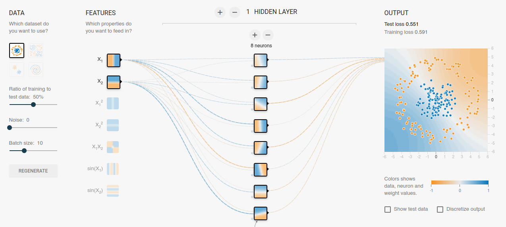
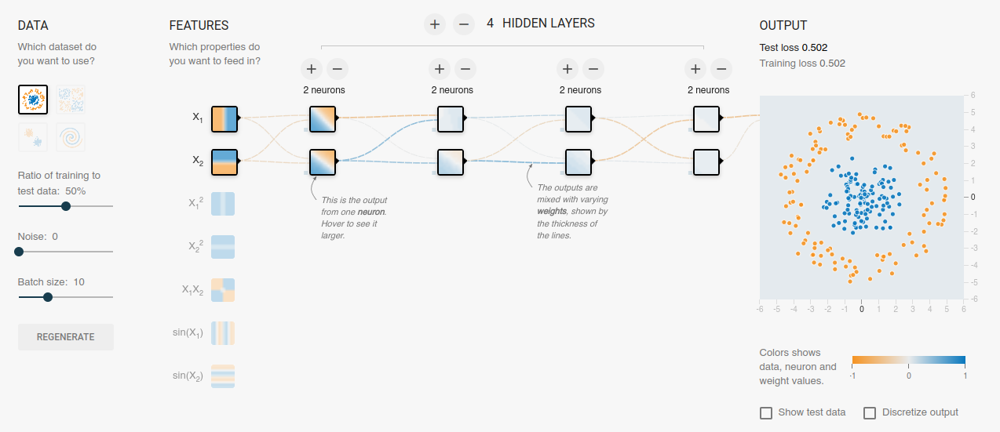
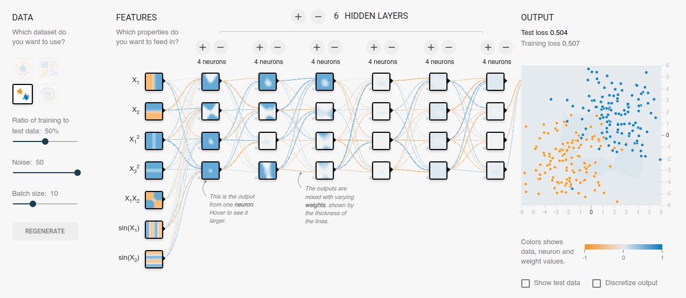
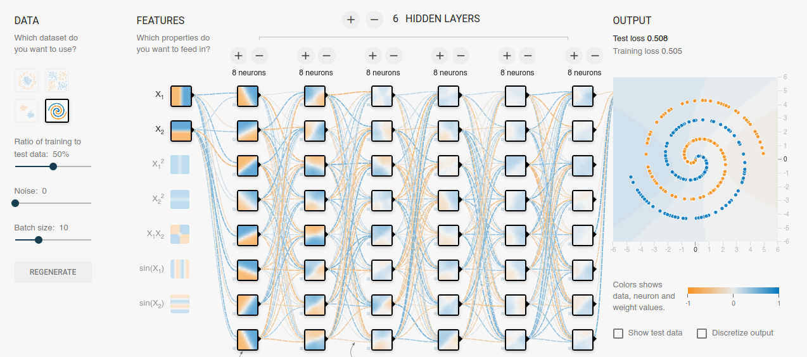

# Lab 8: Neural Networks

In this final lab, we will play around with simple multi-layer neural networks using the [Neural Network Playground](https://playground.tensorflow.org/). The Playground allows is to vary the neural network architecture (number of layers, number of neurons per layer) and other hyperparameters (learning rate, activation function, etc.). Play around with the different options. Next, try to answer the following questions. Take notes to remember what happened, so that we can discuss this together.

- What happens when you select a very small or very large learning rate?

- Add different numbers of hidden layers and different numbers of neurons per hidden layer. Compare the performance of shallow and wide neural networks to the performance of deep and narrow neural networks. Which one performs best? Look at the outputs learned by intermediate neurons.

- Remove the hidden layers so that you have 0 hidden layers. What kind of decision function can this model learn? What would we call this model?

- Use the "Gaussian" dataset with a deep neural network and increase the noise level. The network will start to overfit to the data. What can we do to combat overfitting?

- (Deep) neural networks can approximate complex data distributions. Investigate the training evolution on the "Swiss roll" dataset (bottom right).

- Create a logistic regression model for the "circle" dataset. Can we learn a non-linear decision function? Add non-linear features ($x_1^2$ and $x_2^2). How does the decision function change? Try to find similarly suitable non-linear features for the "exclusive or" dataset.

- Modify your logistic regression model to a multi-layer neural network and remove the non-linear features. Can we still accurately predict this dataset?
